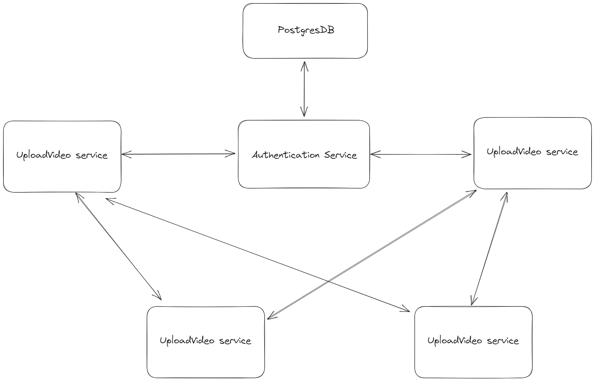

# Video Streaming System

## Table of Contents

1. [Introduction](#introduction)
2. [System Architecture](#system-architecture)
    - [Upload Video Service](#upload-video-service)
    - [Video Streaming Service](#video-streaming-service)
    - [Authentication Service](#authentication-service)
    - [File System Service](#file-system-service)
    - [MySQL DB Service](#mysql-db-service)
3. [Implementation and Technologies Used](#implementation-and-technologies-used)
    - [Directory Structure](#directory-structure)
    - [Services Details](#services-details)
        - [Authentication Service](#authentication-service-1)
        - [Upload Video Service](#upload-video-service-1)
        - [File System Service](#file-system-service-1)
        - [Video Stream Service](#video-stream-service)
4. [Conclusion](#conclusion)

## 1. Introduction

The objective of this assignment was to build a containerized Video Streaming System composed of several microservices, as illustrated in Fig. 2. The system aims to enable users to upload and stream videos, underpinning the system's architecture with multiple services that ensure its modular, maintainable, and scalable characteristics.

## 2. System Architecture

The Video Streaming System can be broken down into the following key microservices:

### Upload Video Service

- **Functionality**: Allows users to upload videos in various formats, post-authentication.

### Video Streaming Service

- **Functionality**: Enables users to stream videos once they've been authenticated.

### Authentication Service

- **Functionality**: Validates user credentials to ensure security.

### File System Service

- **Functionality**: Manages file storage operations.

### MySQL DB Service

- **Functionality**: Stores video metadata, including names and file paths or URLs.

## 3. Implementation and Technologies Used

### 3.1 Directory Structure

The main directory houses the crucial `docker-compose.yml` file, the requisite volume folders, and individual service directories. Each of these service folders contains a Dockerfile which is tailored to package the application, manage dependencies, and execute it.

### 3.2 Services Details

#### Authentication Service

- **Technology Stack**: Spring Boot, JWT for token-based authentication.
- **Functionality**: This service is primarily responsible for validating user credentials. It acts as a gatekeeper for uploading and streaming functionalities, ensuring that only authenticated users have access.
- **Database**: It leverages a separate PostgreSQL container to store user-related data.

#### Upload Video Service

- **Technology Stack**: Spring MVC, Thymeleaf, Tailwind CSS, and JPA.
- **Functionality**: This service offers an interface for users to upload videos. It verifies the user's identity through the Authentication Service, stores video metadata in the MySQL database, and hands over the actual video file to the File System Service for storage.
- **UI Components**: Besides the main video upload functionality, this service also features login and registration pages to facilitate user access.

#### File System Service

- **Technology Stack**: Express.js with TypeScript.
- **Functionality**: A straightforward service aimed at reading and writing video files to its own file system. Its design allows for potential expansions, such as integrating cloud storage solutions like AWS S3.

#### Video Stream Service

- **Technology Stack**: React, TypeScript, Tailwind CSS for the frontend, and an Express.js backend.
- **Functionality**: This service renders the videos for users. The list of available videos, along with their respective paths, are fetched from the MySQL DB Service. The actual video file is streamed through the File System Service.
- **Unique Feature**: It uses long polling every 5 seconds to the backend to check for new video uploads in the MySQL database.
- **UI Components**: Login and registration pages ensure that only authenticated users can access video streaming.

## 4. Conclusion

The Video Streaming System is a robust and scalable platform developed using a microservices architecture. Each service is containerized using Docker, promoting isolation, and ensuring easy scalability. With a combination of powerful technologies like Spring Boot, React, and Express.js, the system offers an effective solution for uploading and streaming video content securely.

The modular design ensures that any part of the system can be scaled or replaced without affecting the entirety of the application. Whether it's enhancing security features, integrating new storage solutions, or expanding user interface components, the architecture supports easy adaptability. Future improvements might include introducing a caching layer for frequently accessed videos, integrating CDN for global access, and implementing more sophisticated authentication and authorization measures.
